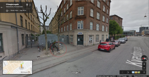
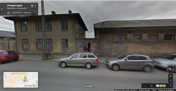
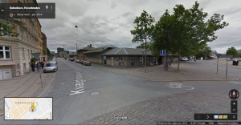

# Sociale Konsekvenser af STPS
## 1. Fattig i 2016
### Halmtorvet – februar 2016

Hér endte jeg den dag. Det var i starten af februar 2016, og enten samme dag, som jeg var i Matthæusgade, eller dagen efter. Det var blevet mørkt. Det eneste sted jeg angiveligt kunne få noget at spise uden penge. Jeg gik op ad de få trin op til indgangsdøren. Den var flankeret af et par mænd med slidt tøj, slidte sko, hættetrøjer og udtryksløse, blege, hærgede ansigter. Omkring indgangen stod der et par andre mænd og kvinder, som på samme tid så både meget forskellige og samtidigt helt ens ud; lidt som de to mænd umiddelbart ved siden af døren. Jeg havde stillet min cykel op ad et træ, på den modsatte side af gaden, og selv om jeg havde låst den, regnede jeg ikke med at den fortsat stod der, når jeg vendte tilbage.

Gik op ad trappen, gennem døren ud i en lille gang. På højre side var der en mørkegrøn trappe, og på de nederste trappetrin sad der en yngre mand. Han havde navneskilt på, ergo var han ansat. Han spurgte mig om, hvad mit ærinde var, og jeg svarede, at jeg havde hørt, at man kunne få noget at spise på stedet. Det mente han ikke umiddelbart, men jeg kunne tage plads og vente på sygeplejersken, og spørge hende, om hun havde mulighed for at hjælpe mig. Jeg gik til venstre ad den korte gang, gennem endnu en dør til endnu en kort gang, parallelt med den, jeg kom fra. På gangen var der på begge sider monteret fem-seks siddepladser, hvidt metalstel og med sæde i lakeret, lyst træ. Lidt i stil med dem, man ser i nogle venteværelser på S-togsstationer.

Jeg satte mig på et sæde på venstre side af gangen. Et par sæder fra mig sad en yngre kvinde med lyst hår. Hun var slank og ikke miseriespræget, men hendes ellers rimeligt modebevidste og alderssvarende tøj var snavset, omend intakt. Det samme var hendes ansigt og ben. Hun havde en stor rygsæk stående ved siden af sig på gulvet. En backpacker. Hun havde smøget sine bukseben op til knæniveau og sad med bare tæer. Der var snavs på hendes fødder og blod fra området omkring hendes storetå (kan ikke huske hvilken side) og hun sad og forsøgte at vaske såret. Da sygeplejersken kom ud, talte kvinden norsk til hende. Jeg kan ikke huske hvad hun sagde, og jeg undrede mig lidt over, hvad kvindens baggrund var. Hun virkede ikke påvirket af alkohol eller stoffer, og hun fremstod psykisk upåfaldende.

Til venstre, for enden af gangen, var der en dør, givetvis til et toilet. Man kunne med mellemrum høre højlydt hoste komme fra et sted bag døren. Det var ikke tør hoste, men udtalt purulent, som fra en af svær lungebetændelse lidende. Vedkommende kastede også op et par gange i den godt og vel halve time, jeg sad og ventede. Det skete et par gange at en ansat gik hen til toiletdøren for at høre om personen på den anden side var ok. Jeg spurgte en af personalet, en lidt ældre mand, om der var noget, jeg kunne gøre, for det lød til at være alvorligt. Han sagde, at det var der desværre ikke, for personen på toilettet nægtede at komme ud eller modtage hjælp. Han sagde at hun sikkert sad og røg heroin.

Så blev det min tur, og sygeplejersken førte mig ind på hendes lille kontor på venstre side af gangen. Hun var vel fem år yngre end jeg, med “robust” kropsbygning, mørkt skulderlangt hår, og et sydeuropæisk udseende (meget generaliserende, men bedst dækkende udtryk). Hun havde et venligt ansigt, talte tilpas højt og tydeligt og have et fast blik. Hun var meget sympatisk og engageret, hvilket de to mandlige ansatte, jeg talte med i øvrigt også var.

Der var ikke andre ventende på det tidspunkt, så vi sad og talte sammen et stykke tid. Hun var overrasket over min henvendelse, for jeg var på alle måder diametralt modsat de mennesker, der ellers henvendte sig hos hende. Jeg lignede og fremstod som én, der boede i Dronningens Tværgade. Samtalen varede et stykke tid, for hun var rent faktisk interesseret i at høre min historie, som hun hyppigt spurgte ind til.

Da jeg var færdig med min beretning var hun dog ikke spor overrasket over, hvorfor jeg var endt hos hende. Hun gav udtryk for, at hun godt kunne forstå hvordan en usædvanlig kæde af uheldige begivenheder kunne resultere i en cykeltur til Halmtorvet hos hende. Jeg fortalte hende, at det virkede som om at hendes arbejde, selv om det måske nok var til tider overordentligt stressende og ligefrem farligt, faktisk virkede utroligt meningsfuldt; man kunne tilsyneladende med få ressourcer hjælpe virkeligt syge mennesker uforholdsmæssigt meget. Som sandt var (og fortsat er) sagde jeg, at jeg ville ønske, at jeg kunne arbejde hos hende som frivillig, bare et par gange om ugen. Det virkede som sagt utroligt meningsfuld og samtidig fagligt spændende. Det kunne jeg helt sikkert godt fortalte hun.

Takket være embedslæge Elisabet Tornberg Hansen og Styrelsen for Patientsikkerhed, måtte jeg desværre ikke (jeg har aldrig fejlbehandlet eller skadet nogen patienter, hvilket er et citat fra embedslæge Elisabet Tornberg Hansen selv, se andet steds). Jeg fortalte sygeplejersken om dette, samt at jeg ville høre fornævnte vanvittige embedslæge om jeg kunne få lov til at være ulønnet frivillig på stedet. Jeg glemmer aldrig og jeg holder mit løfte, så hvis jeg mod forventning får lov til at arbejde igen, så vil jeg ringe til sygeplejersken som det første.

Anyway, tilbage til historien. Det var i sagens natur mest hyggesnak med sygeplejersken, for selv om hun gerne ville, så kunne hun ikke hjælpe mig med noget som helst udover en taxabon til en kørsel til nærmeste skadestue. Der var intet mad på stedet, ingen kontanter, ikke noget som helst. Jeg takkede hende mange gange, for jeg var jo ikke ved at dø, og på trods af hendes magtesløshed, havde hun givet mig noget, der var mere værd end det, jeg kom efter, nemlig oprigtig forståelse af min situation.

Utroligt nok var cyklen urørt. Måske fordi den var for værdiløs, selv for narkomanerne.

Den sygeplejerske er til dato fortsat den eneste offentlige ansatte, der reelt har hjulpet mig. Et par uger senere vendte jeg tilbage. Jeg havde på det tidspunkt fået lånt lidt penge, og i Lidl på Vesterbrogade (billede) var der tilbud på flødeboller, 6 stk. for 5 kr. Uhørt billigt, og da jeg fortsat ikke havde så mange penge, at det gjorde noget, ikke kunne købe en ordentlig gave til sygeplejersken og de andre ansatte, så købte jeg for 80 kr. flødeboller (ret sikker på at dette beløb stemmer). Det var formiddag og solen skinnede fra en skyfri himmel. Jeg mødte op, men det var et andet hold, der var på arbejde. Jeg fortalte dem kort om hvorfor jeg kom med flødeboller, jeg takkede også dem for det arbejde, de udførte, og de virkede positivt overraskede (håber jeg!). Jeg håber sgu at det er tanken, der tæller, for de flødeboller gjorde det ikke i sig selv. De lovede at hilse sygeplejersken og det resterende personale fra den pågældende dag og jeg forhold stedet og gik en tur på Vesterbro i den varme sol.

## 2. Fattig i 2017

## 3. Fattig i 2018
